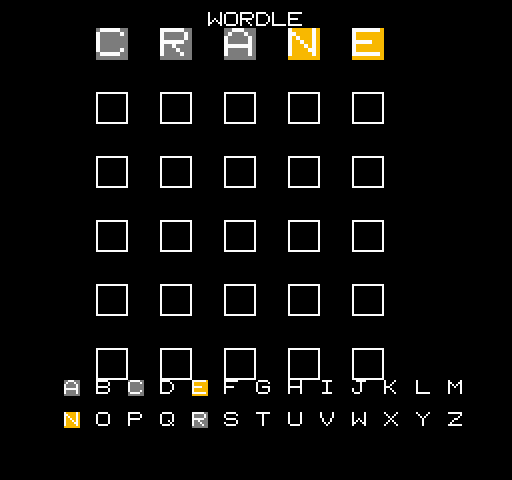

# NES Wordle

Wordle for the Nintendo Entertainment System, written from scratch in 6502
assembly. It runs in any NES emulator and on real hardware (NROM / mapper 0).



## Features

- 6×5 guess board with big, colored letter tiles
- **Green / yellow / gray** scoring with correct duplicate-letter handling
- A **9,981-word** validation dictionary — invalid guesses show `NOT A WORD`
- Random secret word each game from a curated 64-word answer pool
- **Win / lose** messages and instant **restart**
- A **blinking cursor** on the active box
- A live **A–Z used-letter keyboard** that tracks each letter's best state

Everything fits in a **32KB NROM cartridge** (a 40,976-byte `.nes` file).

## Controls

The whole game is playable with just the **D-pad** (arrow keys in an emulator):

| Input | Action |
|-------|--------|
| Up / Down | Change the current letter |
| Right | Confirm letter / next box (submit on the last box) |
| Left | Backspace |
| Right / A / Start (after game over) | Restart |

The NES A / B / Start buttons also work if you prefer.

## Build

Requires the [cc65](https://cc65.github.io/) toolchain and Python 3.

```sh
make          # produces build/wordle.nes
```

`make` regenerates the tile graphics (`tools/make_chr.py`) and the packed word
dictionary (`tools/make_words.py`, built from `/usr/share/dict/words`) before
assembling and linking with `ca65` / `ld65`.

Then open `build/wordle.nes` in an emulator such as
[Mesen](https://www.mesen.ca/).

## How it works

A few NES-specific problems and their solutions:

- **The dictionary.** A 32KB cartridge can't hold a normal word list, so each
  5-letter word is packed into a single 24-bit number (26⁵ < 2²⁴ → 3 bytes),
  sorted, and looked up with binary search.
- **Per-tile color.** The PPU only assigns palettes per 16×16-pixel region, so
  each board cell and each keyboard key is laid out to own its own attribute
  block, and the keyboard uses a small RAM shadow of the attribute table.
- **Mid-game drawing.** Video memory can only be written during vblank, so all
  cell/keyboard updates happen in the NMI handler.

## Testing

`tools/` contains a headless test harness built on
[`nes-py`](https://github.com/Kautenja/nes-py) that renders the ROM to PNG and
scripts controller input, used to verify scoring, validation, win/lose, and
restart without a GUI.

## License

MIT
